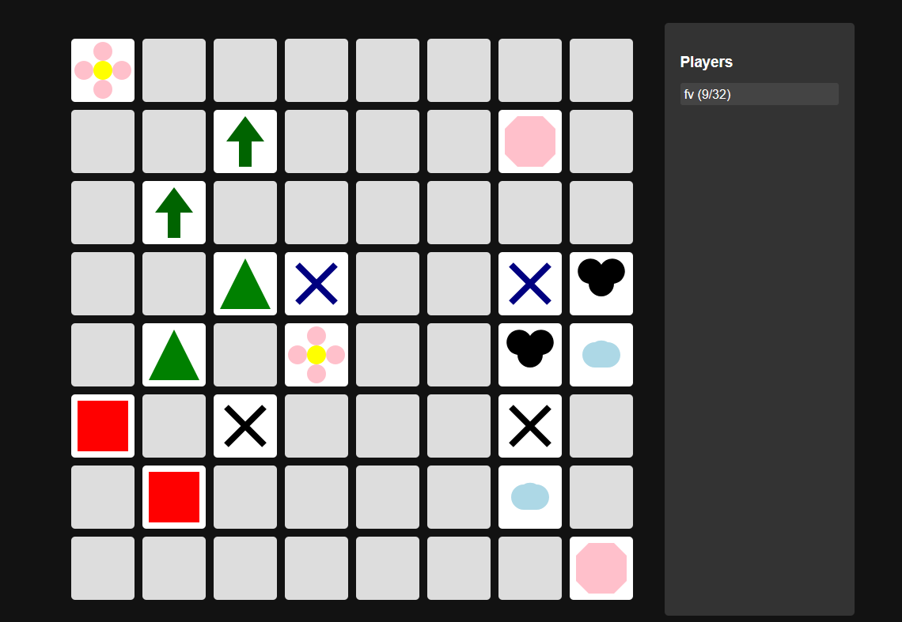

# **Match the Grid** 🎮  

Welcome to **Match the Grid**, an engaging puzzle game where your goal is to find sequences of identical shapes in an **8x8 grid**. Test your observation and matching skills as you uncover patterns and level up!  

---

## **Features** 🌟  
- 🧩 **Challenging Gameplay**: Discover identical patterns hidden in an 8x8 grid.  
- 🎨 **Stylish Graphics**: Clean and visually appealing interface.  
- 🕹️ **Easy to Play**: Simple mechanics, perfect for all ages.  
- 💡 **Brain Teasers**: Improve your focus and cognitive skills while having fun.  

---

## **How to Play** 🕹️  
1. Open the game and start your first match.  
2. **Scan the Grid**: Observe the 8x8 grid carefully.  
3. **Find Matches**: Identify sequences of identical shapes (rows, columns, or diagonal).  
4. Score points as you find matches and aim for a high score.  

---

